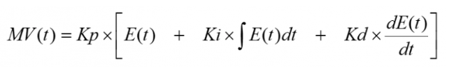

## Relatório técnico – Simulação e Controle de um Quadricóptero LPV

> **Baseado no código original de Mark Misin**
> Este projeto partiu do código de Mark Misin apresentado no curso
> `Applied Control Systems 3: UAV drone (3D Dynamics & control)` na Udemy
> (licença mantida nos arquivos), que modela o quadricóptero Astec Hummingbird
> com um controlador **LPV-MPC**.
> A presente versão acrescenta **injeção de dependência** para controladores,
> um **PID de atitude** e uma nova classe de animação.
> A presente versão foi desenvolvida por **Samuel Lucas** para a matéria
> *VANT Quadricóptero: Dinâmica e Controle*.

---

### Estrutura geral do sistema de controle


* **Outer loop**: lineariza posição, calcula empuxo total `U1` e ângulos **phi** e **theta**.
* **Inner loop**: controla atitude com MPC *ou* PID, atualizando `U2 U3 U4`.
* **Planta**: modelo LPV discreto (`LPV_cont_discrete`) + integração RK4.

## Dinâmica da planta – modelo do quadricóptero

A planta simula **12 estados** no vetor

```
[u v w  p q r  x y z  phi theta psi]
```

onde:

| Símbolo         | Significado                                   | Unidade |
| --------------- | --------------------------------------------- | ------- |
| `u v w`         | Velocidades lineares no eixo corpo **X Y Z**  | m / s   |
| `p q r`         | Velocidades angulares no eixo corpo **X Y Z** | rad / s |
| `x y z`         | Posição inercial                              | m       |
| `phi theta psi` | Ângulos roll, pitch, yaw                      | rad     |

---

### 1. Força

* `U1` – empuxo total (N)
* `F_d,·` – arrasto opcional (ativado por `drag_switch`)

---

### 2. Torque

* `U2 U3 U4` – torques roll, pitch, yaw (N·m)
* `J_tp` – inércia das hélices
* `omega_tot = ω₁ − ω₂ + ω₃ − ω₄`

---

### 3. Cinemática (corpo → inercial)

* `R` – matriz de rotação 3-2-1
* `T` – matriz de transformação angular

---

### 4. Integração numérica

* **Runge–Kutta 4ª ordem** em cada `Ts = 0.1 s`.
* Subdivisão `sub_loop = 5` → passo interno de 20 ms (suaviza a animação).

---

### 5. Modelo LPV para controle

`LPV_cont_discrete()` lineariza apenas os eixos de atitude:

* Estados locais: `[phi phi̇ theta thetȧ psi psi̇]`
* Entradas: `[U2 U3 U4]`
* Matrizes `Ad Bd` dependem de `omega_tot`, `phi̇`, `thetȧ`
* Discretização por Euler: `Ad = I + Ts·A`

---

### 6. Conversão torques → rotações dos rotores

$$
\begin{bmatrix}\omega_1^2\\\omega_2^2\\\omega_3^2\\\omega_4^2\end{bmatrix}
= A_\omega^{-1}\!
\begin{bmatrix}
U_1/c_t \\ U_2/(c_t l) \\ U_3/(c_t l) \\ U_4/c_q
\end{bmatrix}
$$

`A_ω` é a matriz de mistura que relaciona empuxo/torques a ω² dos quatro motores.

---

### 7. Constantes físicas (Astec Hummingbird)

| Parâmetro              | Valor                                   |
| ---------------------- | --------------------------------------- |
| Massa `m`              | 0.698 kg                                |
| Gravidade `g`          | 9.81 m / s²                             |
| Inércias `Ix Iy Iz`    | 0.0034 kg·m², 0.0034 kg·m², 0.006 kg·m² |
| Braço `l`              | 0.171 m                                 |
| Coef. de empuxo `c_t`  | 7.6 × 10⁻⁸ N·s²                         |
| Coef. de arrasto `c_q` | 2.7 × 10⁻⁹ N·m·s²                       |
| Inércia hélices `J_tp` | 1.30 × 10⁻⁶ kg·m²                       |

---

## Funcionamento do PID de atitude



O **PidController** substitui o MPC na malha interna e é executado **40 Hz** (quatro vezes dentro de cada `Ts = 0,1 s`). A cada sub-passo ele realiza:

| #     | Etapa                         | Detalhes / fórmulas                                                                                                   |
| ----- | ----------------------------- | --------------------------------------------------------------------------------------------------------------------- |
| **1** | **Erro de atitude**           | `e = [phi_ref – phi,  theta_ref – theta,  psi_ref – psi]`                                                             |
| **2** | **Derivada do erro**          | `de_dt = –[p, q, r]`  <br>(as velocidades angulares já são as derivadas dos ângulos)                                  |
| **3** | **Integral com anti-wind-up** | `int_err += e · dt`  <br>`int_err = clip(int_err, ±0.5 rad)`                                                          |
| **4** | **Ganhos**                    | Matriz diagonal por eixo  <br>`Kp = diag(KP, KP, 2·KP)`  <br>`Ki = diag(KI, KI, 2·KI)`  <br>`Kd = diag(KD, KD, 2·KD)` |
| **5** | **Lei de controle**           | $\tau = K_p\,e \;+\; K_i \!\int e \;+\; K_d\,\dot e$ <br>Retorna **(U₂, U₃, U₄)** em N·m                              |
| **6** | **Aplicação na planta**       | Os torques são convertidos em ω² → ω e passados para `open_loop_new_states()`                                         |

---

### Observações finais

* **Créditos** – O modelo original, equações e algoritmo MPC pertencem a
  **Mark Misin**; a licença e aviso de copyright
  foram mantidos.
* **Contribuição atual** – Inclui o **PID de atitude**, injeção de dependência,
  refatoração de animação, estrutura modular e este relatório.

---

© 2025 – Projeto de estudo e extensão do código de Mark Misin,
desenvolvido por **Samuel Lucas** para a matéria
*VANT Quadricóptero: Dinâmica e Controle*.
