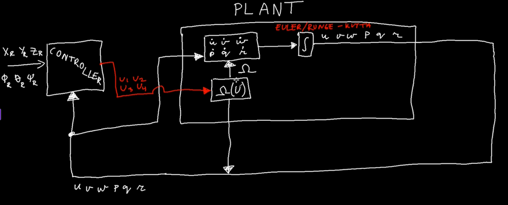

## Relatório técnico – Simulação e Controle de um Quadricóptero LPV

> **Baseado no código original de Mark Misin**\
> Este projeto partiu do código de Mark Misin apresentado no curso `Applied Control Systems 3: UAV drone (3D Dynamics & control)` na Udemy (licença mantida nos arquivos), que modela o quadricóptero Astec Hummingbird com um controlador **LPV-MPC**.\
> A presente versão acrescenta **injeção de dependência** para controladores, um **PID de atitude** e uma nova classe de animação.\
> A presente versão foi desenvolvida por Samuel Lucas para a a matéria de VANT Quadricóptero: Dinâmica e Controle.

---

### 1 . Estrutura geral do sistema de controle



* **Outer loop**: lineariza posição, calcula empuxo total `U1` e ângulos **phi** e **theta**.
* **Inner loop**: controla atitude com MPC *ou* PID, atualizando `U2 U3 U4`.
* **Planta**: modelo LPV discreto (`LPV_cont_discrete`) + integração RK4.

--- 
### 2 . Principais arquivos e papéis

| Arquivo                             | Função                                                                                                                                                                                                                                |
|-------------------------------------|---------------------------------------------------------------------------------------------------------------------------------------------------------------------------------------------------------------------------------------|
| **`support_files_drone.py`**        | • Define **constant dict** (massa, inercias, CT/CQ, pesos MPC etc.)<br>• Geradores: trajetória, controlador de posição (`pos_controller`)<br>• Modelo LPV discreto (`LPV_cont_discrete`)<br>• Integração RK4 (`open_loop_new_states`) |
| **`controllers/pid_controller.py`** | Implementa **`PidController`** (ganhos diagonalizados, anti-wind-up).                                                                                                                                                                 |
| **`controllers/mpc_controller.py`** | Envolve o algoritmo MPC original numa classe com a mesma interface.                                                                                                                                                                   |
| **`MAIN_LPV_MPC_drone.py`**         | Classe **`DroneLPV`** – laço de simulação:<br>  1. gera referências<br>  2. escolhe controlador (`"pid"` ou `"mpc"`) via string<br>  3. cria log de estados/entradas.                                                                 |
| **`view/DroneAnimator.py`**         | Nova classe **`DroneAnimator`**: animação 3-D, sub-plots e “summary plots”.                                                                                                                                                           |
| **`index.py`**                      | Script mínimo: cria `DroneLPV` e roda `simulate('pid')`.                                                                                                                                                                              |
| **`utils/mpl_backend.py`**          | Faz a checagem se o sistema operacional é MacOS, se for a renderização é feita encima do SO, caso contrário, matplotlib escolhe a plataforma.                                                                                         |     

---

### 3 . Conceitos de controle implementados

| Conceito                           | Descrição / Implementação                                                                                                                                               |
| ---------------------------------- | ----------------------------------------------------------------------------------------------------------------------------------------------------------------------- |
| **LPV (Linear Parameter-Varying)** | Modelo linearizado em torno do estado atual; parâmetros variam com ω\_total, phi, theta e psi. Discretização por Euler: `Ad = I + Ts·A`.                                |
| **MPC**                            | Horizonte `hz = 4`; matrizes compactas `Hdb, Fdbt` montadas em `mpc_simplification`. O solver usa inversa analítica (`np.linalg.inv(Hdb)`) para velocidade.             |
| **PID de atitude**                 | Ganhos proporcionais iguais em roll e pitch, 2× em yaw; derivada direta de `p,q,r`; integral saturada (±0,5 rad) para evitar wind-up. Executa a cada sub-passo (40 Hz). |
| **Controle de posição**            | Feedback-linearization: calcula `U1 = (vz+g)m/∘` e converte erros de posição para referências de **phi** e **theta** via polos `px, py, pz`.                            |
| **Runge–Kutta 4**                  | Integra forças, torques e arrasto (`drag_switch`) dentro de `open_loop_new_states`, subdividindo `Ts` em `sub_loop = 5` para suavizar a animação.                       |

---

### 4 . Alterações e aprimoramentos realizados

| Tema                          | Alteração                                                                                                                  |
| ----------------------------- | -------------------------------------------------------------------------------------------------------------------------- |
| **Injeção de dependência**    | `DroneLPV.simulate(controller: str)` escolhe dinamicamente **PID** ou **MPC** sem alterar lógica da planta.                |
| **Classes de controlador**    | `PidController` e `MpcController` obedecem ambos ao método `control(state, …)`, facilitando testes A/B.                    |
| **Registro de velocidades**   | Vetor `velocityXYZ_total` agora armazenado a cada sub-passo para plot de Ẋ Ẏ Ż.                                         |
| **Animation API**             | `DroneAnimator` reúne todo o código gráfico; suporta `play()` (tempo real) e `plot_summary()` (plots finais).              |
| **Arquitetura de diretórios** | Pastas `controllers/`, `view/`, separando lógica, visualização e *entry point*.                                            |
| **Documentação**              | Este relatório `.md` e comentários nos arquivos esclarecem origem (Mark Misin) e novas funcionalidades (PID, refatoração). |

---

### 5 . Como rodar

```bash
pip install -r requirements.txt
python index.py          # usa PID
# ou
python - <<'PY'
from MAIN_LPV_MPC_drone import DroneLPV
lpv = DroneLPV()
lpv.simulate('mpc')
PY
```

A simulação abre a animação 3-D; ao fechar, surgem os gráficos estáticos gerados por `plot_summary()`.

---

### 6 . Observações finais

* **Créditos**:O modelo original, equações e algoritmo MPC pertencem a **Mark Misin**; a licença e aviso de copyright foram mantidos.
* **Contribuição atual**: Inclui o **PID de atitude**, injeção de dependência, refatoração de animação, estrutura modular e este relatório.

---

© 2025 – Projeto de estudo e extensão do código de Mark Misin, desenvolvido por Samuel Lucas para a matéria de VANT Quadricóptero: Dinâmica e Controle.
